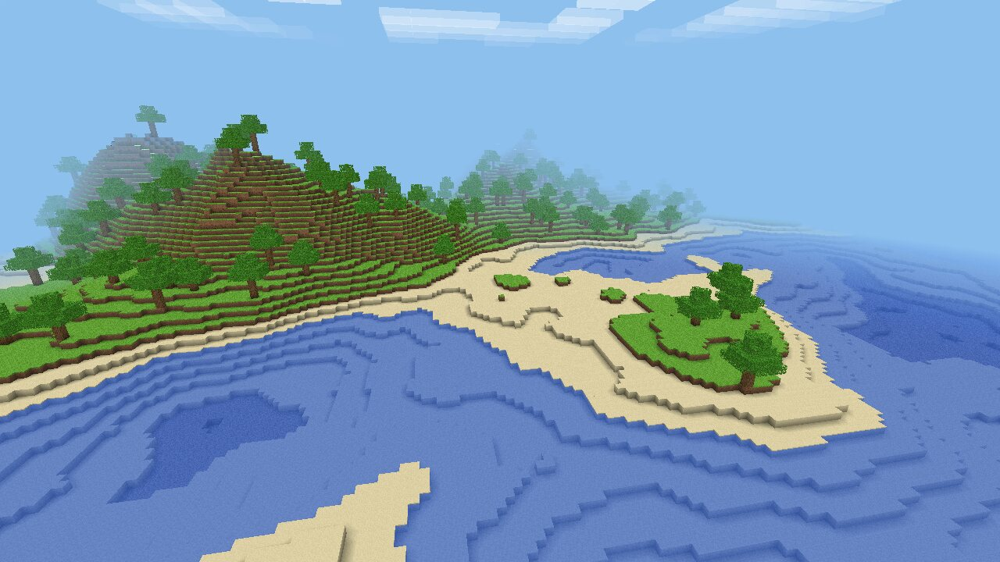
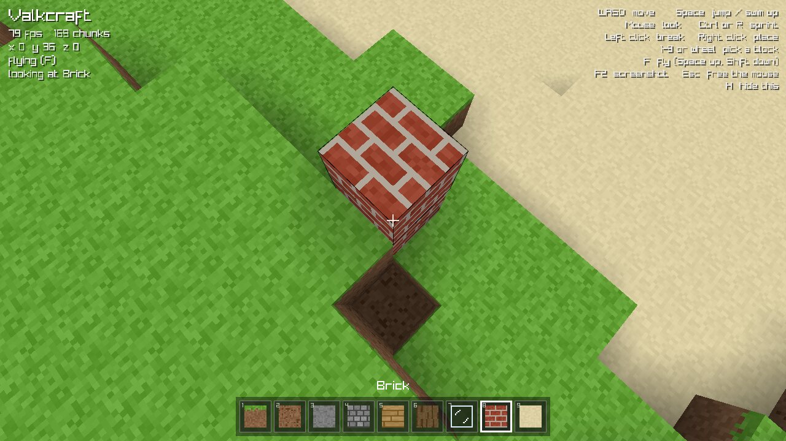
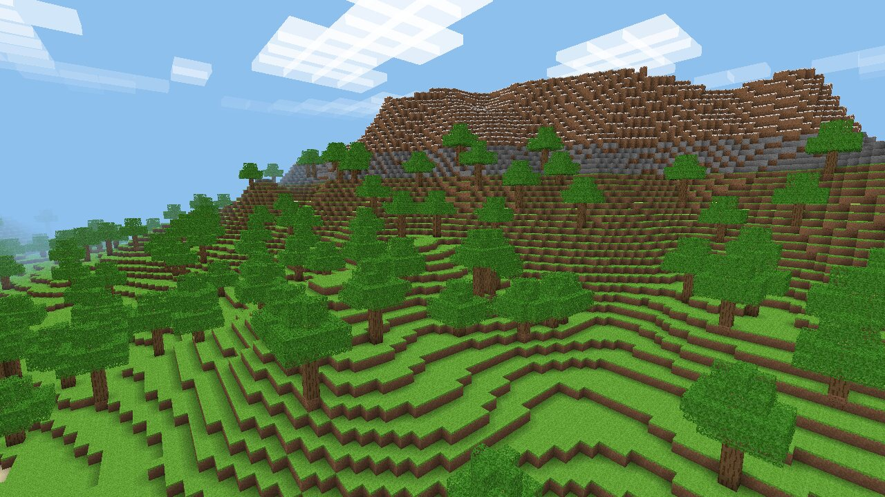

# Valkcraft

A small Minecraft-like game written in [Valk](https://valk-lang.dev), on top of
[valk-raylib](https://github.com/ctxcode/valk-raylib). An endless world of hills, beaches,
forests and mountains to walk around in and build on, with caves below to dig into.





## Play

It needs Valk 0.7.7 or newer and raylib 6.0 (`pacman -S raylib`, `brew install raylib`, or
the library from raylib's [release page](https://github.com/raysan5/raylib/releases/tag/6.0)).
See [valk-raylib](https://github.com/ctxcode/valk-raylib#requirements) for each system.

```sh
git clone https://github.com/ctxcode/valk-example-game
cd valk-example-game
make deps       # vman install: fetches valk-raylib
make run
```

With raylib unpacked somewhere instead of installed: `make run RAYLIB_LIB=~/raylib-6.0_linux_amd64/lib`.

| key | |
| --- | --- |
| WASD, mouse | walk and look |
| Space | jump, swim up |
| Ctrl or R | sprint |
| Left click | break the block you look at |
| Right click | place the block in hand |
| 1-9, mouse wheel | pick a block |
| F | fly: Space goes up, Shift down |
| F2 | screenshot |
| H | hide the help |
| Esc | let go of the mouse |

Options: `--seed N` for another world, `--distance N` for how many chunks you see in
each direction (8 by default), `--size 1920x1080` for the window. `--screenshot FILE` renders
one frame once the world is loaded and quits; `--at X,Z`, `--up BLOCKS`, `--yaw` and `--pitch`
pick the view, and `--hud` keeps the crosshair and hotbar in it.



## How it works

| file | |
| --- | --- |
| `src/main.valk` | the window, input and the frame |
| `src/terrain.valk` | world generation: a height map from layered Perlin noise (continents, hills, ridged mountains), sand at the shore, snow up high, caves from 3D noise a few blocks under the ground, and trees |
| `src/noise.valk` | seeded Perlin noise |
| `src/chunk.valk` | chunks of 16 x 96 x 16 blocks, and the mesher: only faces next to air get drawn, each corner darkened by the blocks around it (ambient occlusion) |
| `src/world.valk` | loading chunks around the player nearest first, a few per frame, dropping them far away, drawing them, and the ray that finds the block you look at |
| `src/player.valk` | walking, jumping, swimming and flying, colliding one axis at a time |
| `src/atlas.valk` | all block textures, painted pixel by pixel at startup: there are no image files |
| `src/shaders.valk` | fog that fades the world into the sky, and see-through leaves and glass |
| `src/clouds.valk` | a layer of clouds drifting by |
| `src/hud.valk` | crosshair, hotbar and text |

Blocks you change are kept while the game runs; the world itself comes from the seed, so
nothing is saved to disk.

## Tests

```sh
make test
```

The tests in `src/tests.valk` run without a window: terrain generation, trees that cross
chunk borders, block lookups at negative coordinates, the block ray, falling and bumping
into walls, and which faces the mesher emits.
