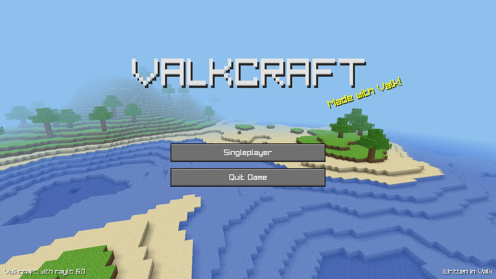
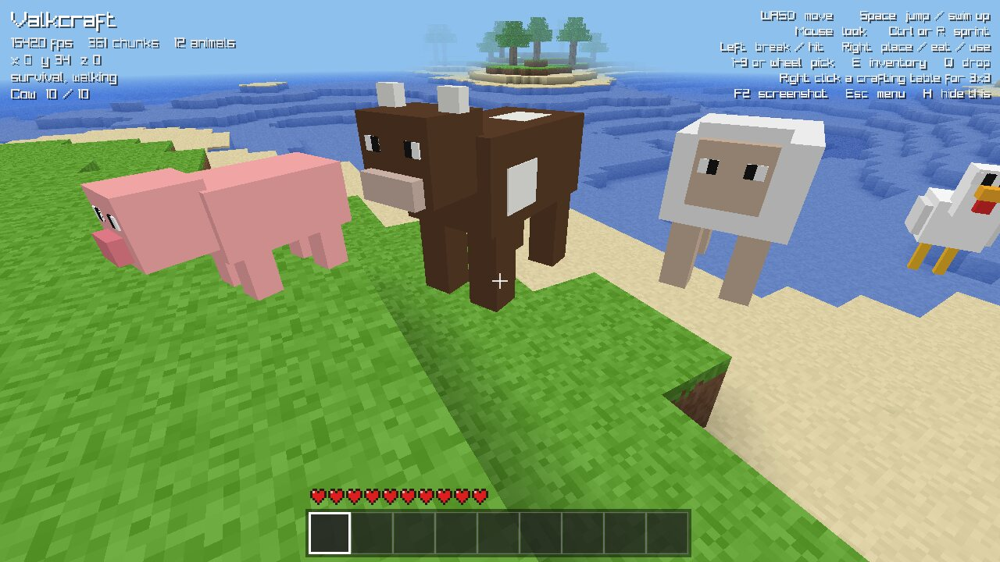
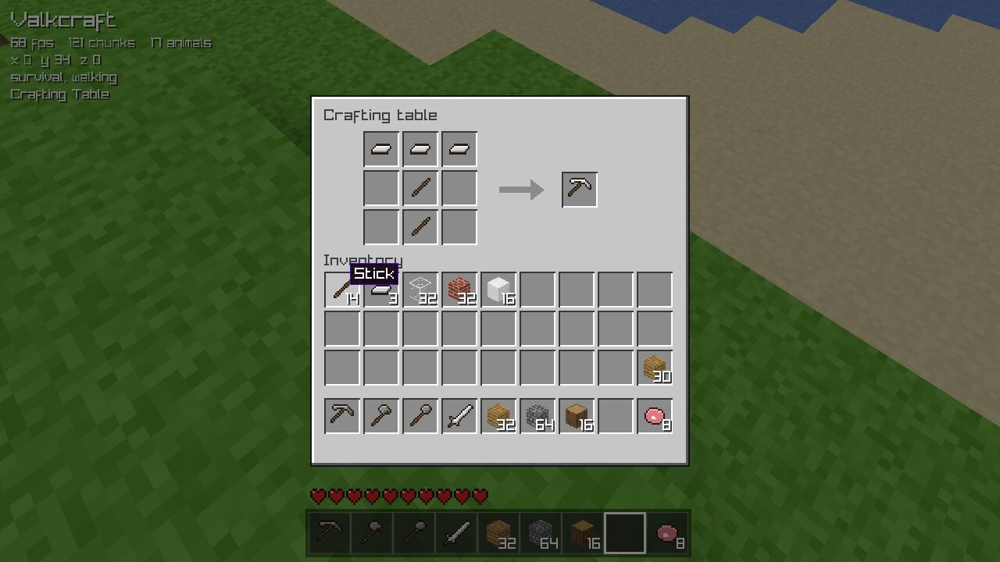
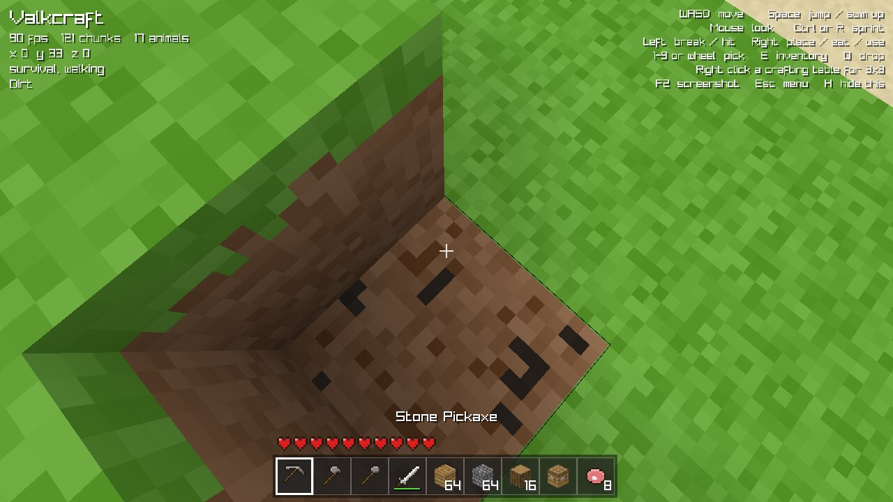

# Valkcraft

A small Minecraft-like game written in [Valk](https://valk-lang.dev), on top of
[valk-raylib](https://github.com/ctxcode/valk-raylib). Endless worlds of hills, beaches,
forests and mountains, with caves below; survival with crafting, tools and animals, or
creative with every block.





## Play

It needs Valk 0.7.7 or newer, and raylib 6.0. With raylib installed (`pacman -S raylib`,
`brew install raylib`, see [valk-raylib](https://github.com/ctxcode/valk-raylib#requirements))
it uses that one; otherwise `make deps` downloads raylib's own build of it into
`vendor/raylib`.

```sh
git clone https://github.com/ctxcode/valk-example-game
cd valk-example-game
make deps       # valk-raylib, and raylib when the system has none
make run
```

To build with a compiler of your own, put `vc := ~/path/to/valk` in a file `local.mk`
(git ignores it), or run `make run vc=~/path/to/valk`.

**Singleplayer** on the title screen lists your worlds, the last played first. Create a
new one with a name, a seed (a number, or any text; leave it empty for a random one) and a
game mode; delete one you are done with.

Worlds save themselves: every 30 seconds, when you open the game menu, when you quit to the
title, and when you close the window. They go to `~/.local/share/valkcraft/worlds` on Linux
(or `$XDG_DATA_HOME/valkcraft/worlds`), `~/Library/Application Support/Valkcraft/worlds` on
macOS and `%APPDATA%\Valkcraft\worlds` on Windows; `--saves DIR` picks another folder. A
world is its seed plus what you changed: only the chunks you built in or dug out are
stored, compressed, next to a `world.json` with the player, the inventory and the items on
the ground.

The game mode can change at any time, with F4 or in the game menu (Esc).

- **Survival:** 10 hearts. Falling more than 3 blocks hurts, and so does staying under water
  once the air runs out; health slowly comes back, and food brings it back faster. Broken
  blocks drop as items to pick up, placing a block uses one, and dying drops everything.
- **Creative:** every item from the inventory, blocks break at once, you can fly, and
  nothing hurts.

| key | |
| --- | --- |
| WASD, mouse | walk and look |
| Space | jump, swim up |
| Shift | sprint |
| Ctrl | crouch: slower, and you do not walk off edges |
| Left mouse | break the block you look at (hold), hit an animal |
| Right mouse | place a block, eat, open a crafting table (crouch to place a block on it) |
| 1-9, mouse wheel | pick a hotbar slot |
| E | inventory |
| Q | drop the held item |
| F | fly, in creative: Space goes up, Ctrl down |
| F4 | switch between creative and survival |
| F2 | screenshot |
| H | hide the help |
| Esc | game menu: back to the game, game mode, save and quit |

In the inventory a click picks a stack up or puts it down, a right click takes half or
puts one down, and shift-click moves a stack between the hotbar and the rest. A click
outside the window drops what the mouse holds.

## Crafting, tools and animals



The inventory has a 2x2 crafting grid; a crafting table (right click it) has a 3x3 one.
Shapes can go anywhere in the grid, and mirrored:

| recipe | makes |
| --- | --- |
| a log | 4 planks |
| two planks, one above the other | 4 sticks |
| 2x2 planks | a crafting table |
| three of a material over two sticks down the middle | a pickaxe |
| two over one and a stick, a stick below | an axe |
| one over two sticks | a shovel |
| two over a stick | a sword |

The material is planks, cobblestone or iron ingots, for wooden, stone and iron tools.



Every block takes a while to break, shown by cracks: shovels are for dirt, grass, sand,
gravel and snow, axes for wood, pickaxes for stone. A better tool is faster (wood 2x, stone
4x, iron 6x). Stone gives nothing without a pickaxe, and iron ore needs a stone one; it
drops iron ingots, since there is no furnace. Tools wear out: a bar under the icon shows
what is left. Leaves sometimes drop a stick; glass drops nothing.

Pigs, cows, sheep and chickens wander around grassland. Hit one and it runs; kill it and it
drops porkchops, beef and leather, mutton and wool, or chicken and feathers. Swords hit
hardest. Right click with meat to eat it.


## How it works

| file | |
| --- | --- |
| `src/main.valk` | the screens (title, world list, new world, loading, playing, inventory, paused, dead) and the options |
| `src/saves.valk` | worlds on disk: the world file, changed chunks deflated, listing and deleting |
| `src/game.valk` | a world being played: the player, inventory, animals, drops, breaking, placing, fighting, damage |
| `src/terrain.valk` | world generation: a height map from layered Perlin noise (continents, hills, ridged mountains), sand at the shore, snow up high, caves from 3D noise a few blocks under the ground, iron ore veins in the stone, and trees |
| `src/noise.valk` | seeded Perlin noise |
| `src/chunk.valk` | chunks of 16 x 96 x 16 blocks, and the mesher: only faces next to air get drawn, each corner darkened by the blocks around it (ambient occlusion) |
| `src/world.valk` | loading chunks around the player nearest first, a few per frame, dropping them far away, drawing them, and the ray that finds the block you look at |
| `src/player.valk` | boxes moving through the blocks, one axis at a time; walking, sprinting, crouching at edges, jumping, swimming, flying, falls and breath |
| `src/blocks.valk`, `src/items.valk` | what every block and item is: textures, hardness, tools, drops, damage, food |
| `src/inventory.valk`, `src/crafting.valk` | stacks in slots, and recipes matched anywhere in the grid |
| `src/mobs.valk`, `src/drops.valk` | animals (models of boxes with swinging legs, wandering, fleeing, loot) and items lying around |
| `src/atlas.valk`, `src/sprites.valk` | all textures, painted at startup: block tiles pixel by pixel, item sprites from rows of text. There are no image files |
| `src/resources.valk` | the shader, meshes, and inventory icons rendered from 3D cubes |
| `src/ui.valk`, `src/menu.valk`, `src/hud.valk`, `src/inventory-screen.valk` | buttons, slots, the menus, the HUD and the inventory window |
| `src/shaders.valk` | fog that fades the world into the sky, see-through leaves and glass, the red flash of a hurt animal |
| `src/clouds.valk` | a layer of clouds drifting by |

Options for trying things out: `--seed TEXT` and `--creative` start a new world right away,
`--kit` starts with tools and blocks, `--animals` puts one of each animal in front of you,
`--distance N` sets how many chunks you see, `--size 1920x1080` the window, and
`--screenshot FILE` renders one frame and quits without saving (`--title`, `--worlds`,
`--inventory` or `--hud` for what is on it; `--at X,Z`, `--up N`, `--yaw`, `--pitch` for the
view). `--frames N` plays N frames and prints the frame rate.

## Tests

```sh
make test
```

The tests in `src/tests.valk` run without a window: terrain, trees across chunk borders,
negative coordinates, the block ray, physics, the mesher, recipes, stacks, break times and
drops, picking items up, fall damage and dying, animals getting hurt and their loot, seeds
from text, crouching at an edge and under a low ceiling, switching game modes mid-fall, and
saving a world and loading it back.
